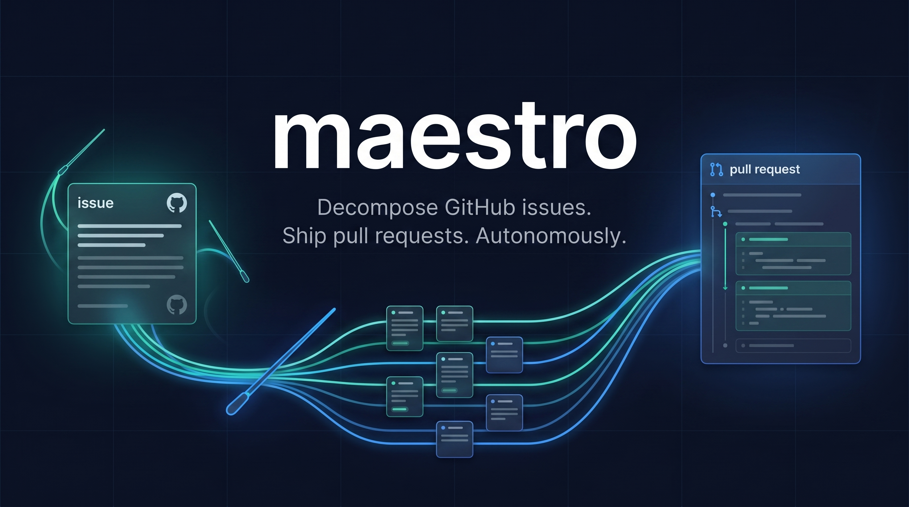
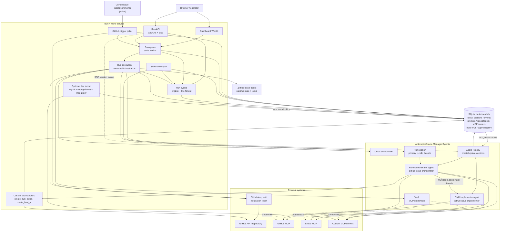
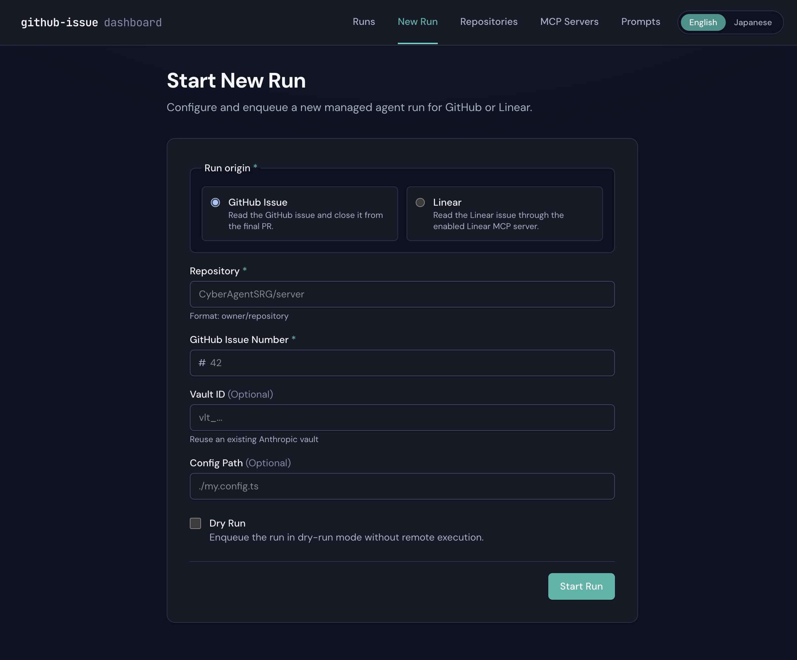
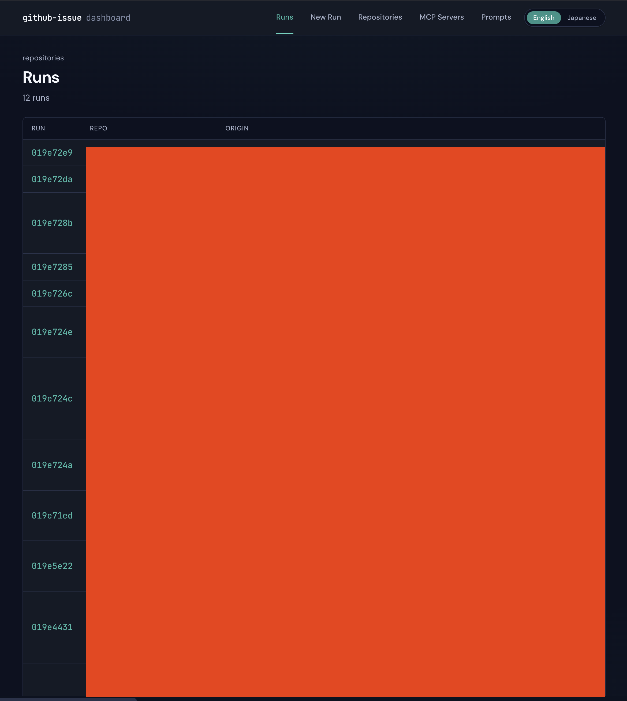

# github-issue-agent

[English](README.md) | **日本語**

GitHub issue を自動的に分解し、実装 PR を作成する HTTP サーバー型エージェント。
WebUI から `--issue 21925 --repo CyberAgentSRG/server` 相当を実行できる。



## 概要

`github-issue-agent` は、GitHub issue を親タスクとして受け取り、それを複数の子 issue（サブタスク）に自動分解し、最終的に 1 つのプルリクエストにまとめて実装を完了させるためのツールです。

Anthropic Managed Agents API (`@anthropic-ai/sdk`) を利用しており、エージェントが GitHub リポジトリを直接操作してタスクを遂行します。

## アーキテクチャ

`github-issue-agent` は、SQLite をローカルの source of truth とする Bun + Hono サービスです。Run は WebUI/API または GitHub trigger poller から開始され、直列の run queue が orchestration を実行します。各実行では repo-scoped な GitHub App token を解決し、Anthropic の cloud environment、Vault に保存された MCP credentials、versioned な parent/child agent を準備してから Managed Agents session を作成します。Parent coordinator は Managed Agents の multi-agent thread 経由で child implementer に実装作業を委譲し、アプリ側の custom tool は sub-issue と最終 PR を作成します。MCP 呼び出しは Anthropic 側から設定済み MCP server に送られます。



## Quick Start

```bash
bun install
export ANTHROPIC_API_KEY=...
export GITHUB_APP_ID=...
export GITHUB_APP_PRIVATE_KEY_PATH=/path/to/github-app.pem
bun run start
# → Listening on http://127.0.0.1:3000
```

ブラウザで http://127.0.0.1:3000 を開く。

ローカル開発手順 (Claude Managed Agents から手元の MCP server に到達するため
の **ngrok-backed dev tunnel** を含む) は
[`docs/DEVELOPMENT.md`](docs/DEVELOPMENT.md) を参照。

## Screenshots




## Environment Variables

| Variable                      | Default                            | Description                                                                                                        |
| ----------------------------- | ---------------------------------- | ------------------------------------------------------------------------------------------------------------------ |
| `PORT`                        | `3000`                             | listen port                                                                                                        |
| `HOST`                        | `127.0.0.1`                        | bind host (set to `0.0.0.0` to expose)                                                                             |
| `DB_PATH`                     | `.github-issue-agent/dashboard.db` | SQLite db                                                                                                          |
| `CONFIG_PATH`                 | (none)                             | optional config TS path                                                                                            |
| `ANTHROPIC_API_KEY`           | (required)                         | Anthropic API key                                                                                                  |
| `GITHUB_APP_ID`               | (required)                         | GitHub App ID                                                                                                      |
| `GITHUB_APP_PRIVATE_KEY`      | (path 未指定時は必須)              | GitHub App private key。`\n` エスケープ可                                                                          |
| `GITHUB_APP_PRIVATE_KEY_PATH` | (none)                             | GitHub App private key PEM ファイルへのパス。`GITHUB_APP_PRIVATE_KEY` 未指定時に使用                               |
| `GITHUB_APP_INSTALLATION_ID`  | (auto)                             | 任意の installation ID。未指定時は各 `owner/repo` から installation を解決                                         |
| `LOG_LEVEL`                   | `info`                             | log level                                                                                                          |
| `LOG_FILE`                    | stderr                             | log file path                                                                                                      |

GitHub App の権限は `Metadata: read`, `Contents: write`, `Issues: write`, `Pull requests: write` を付与してください。workflow ファイルを編集させる場合のみ `Workflows: write` を追加します。

GitHub App private key PEM を Docker image にベイクしないでください。`GITHUB_APP_PRIVATE_KEY`（inline env var）または `/data/secrets/github-app.pem` のような runtime mount 上のファイルを指す `GITHUB_APP_PRIVATE_KEY_PATH` で実行時に渡します。

GitHub App mode で複数 repo を扱う場合は managed vault（`VAULT_ID` 未設定）を推奨します。configured shared vault では GitHub MCP credential が URL ごとに 1 つなので、repo-scoped installation token が相互に上書きされる可能性があります。詳細は `docs/deploy-fly.md#caveat-vault-credential-sharing-in-github-app-mode` を参照してください。

## HTTP API

### POST /api/runs

```json
{ "issue": 42, "repo": "owner/name", "dryRun": false }
```

returns `{ "runId": "uuid" }`

### GET /api/runs

returns `{ "runs": [...], "total": N }`

### GET /api/runs/:runId

returns full run detail

### POST /api/runs/:runId/stop

returns `{ "outcome": "stopped" | "..." }`

### GET /api/runs/:runId/events

Server-Sent Events stream. Supports `Last-Event-ID` for resume.
Event kinds: `phase`, `session`, `subIssue`, `log`, `complete`, `error`.

## WebUI flow

1. ブラウザで `http://127.0.0.1:3000/runs/new` を開く
2. `Issue Number` (例: `21925`)、`Repo` (例: `CyberAgentSRG/server`) を入力
3. (Optional) `Dry-run` にチェック → decomposition プランのみ計算
4. Submit → `/runs/:runId/live` に遷移、SSE でリアルタイム進捗を表示

## Prompt Management

WebUI から、エージェントの **system prompt を閲覧・編集** できます。編集された値は SQLite (`.github-issue-agent/dashboard.db`) に永続化され、次回実行時に DB から読み込まれて Anthropic 側の agent 定義に自動反映されます。

ヘッダーの **Prompts** ナビからプロンプト一覧へ遷移 (`/prompts`) して編集可能です。

## 設定

設定ファイル `github-issue-agent.config.ts` を作成することで、動作をカスタマイズできます。

```ts
import type { Config } from "./src/shared/config";

const config: Config = {
  models: { parent: "claude-opus-4-7", child: "claude-sonnet-4-6" },
  maxSubIssues: 10,
  maxRunMinutes: 120,
  maxChildMinutes: 30,
  pr: { draft: true, base: "main" },
  commitStyle: "conventional",
  git: {
    authorName: "claude-agent[bot]",
    authorEmail: "claude-agent@users.noreply.github.com",
  },
};

export default config;
```

zero data retention (ZDR) 互換性を維持するため、デフォルトの parent model は `claude-opus-4-7` のままです。`claude-fable-5` は `models.parent` または `PARENT_MODEL` で明示的に opt-in できますが、Anthropic では ZDR 環境で利用できず、30 日 retention が必要です。

## コスト

コストは設定したモデルと Anthropic の最新料金に依存します。デフォルトの parent/child の組み合わせは `claude-opus-4-7` / `claude-sonnet-4-6` です。`claude-fable-5` に opt-in した場合は、そのモデルの料金と retention policy が適用されます。

issue の分解からサブタスクの実装完了までの総コストは、issue の規模や生成される子タスクの数に依存します。Anthropic 側のモデル料金は変動するため、最新の価格は公式ドキュメントで確認してください。

## Deployment

Fly.io へのデプロイ手順は `docs/deploy-fly.md` を参照。リポジトリには
`Dockerfile` / `fly.toml` / `scripts/start.sh` を同梱しています。

## E2E Tests

```bash
E2E=1 TEST_REPO=<owner>/<repo> TEST_ISSUE=<n> bun run scripts/e2e-real.ts
```

詳細は `docs/e2e-setup.md` を参照。

## Troubleshooting

- **ロックファイルが残った場合**: `rm .github-issue-agent/run.lock.lock`
- **WebUI に履歴が出ない**: 1 度 issue を実行して DB に書き込む必要があります
- **ポート競合**: `PORT=3097 bun run start`
