# Claude Managed Agents の MCP 連携

## 概要

このドキュメントは、Anthropic の Claude Managed Agents (`@anthropic-ai/sdk@0.90.0`) で MCP (Model Context Protocol) サーバーを連携させる方法と、その制約を整理したものです。本リポジトリは GitHub MCP (`https://api.githubcopilot.com/mcp/`) と連携済みで、parent / child 両方の Managed Agent から利用しています。

別の MCP サーバーを追加する際は、本ドキュメントに記載した 3 点セット (server 宣言・toolset 紐付け・Vault credential) を踏襲してください。

## アーキテクチャ

Managed Agents の MCP は 3 か所に分かれて定義されます。

| 場所 | 役割 | 本リポジトリの該当箇所 |
|---|---|---|
| `agents.create/update` の `mcp_servers` | 接続先 URL を宣言 | `src/shared/agents/parent.ts:16-20`, `src/shared/agents/child.ts:22-27` |
| 同じく `tools` の `mcp_toolset` | その MCP を agent に有効化 | `src/shared/agents/parent.ts:22-28`, `src/shared/agents/child.ts:29-34` |
| `vaults.credentials.create` の credential | 認証トークンを保管 | `src/shared/vault.ts:73-80` |

`sessions.create` には **`vault_ids` のみ** を渡します。Anthropic 側が `mcp_server_url` の一致する credential を自動で適用するため、session/turn 単位で MCP 設定や認証ヘッダを差し込む API は存在しません。

```
Agent definition  ─┐
  mcp_servers      ├─ build & hash → agents.create / update
  tools            ─┘                        │
                                             ▼
Vault                                  Managed Agent (Anthropic)
  credentials.create                         ▲
    mcp_server_url   ─── vault_ids ──── sessions.create
    auth (bearer/oauth)
```

## 制約 (SDK 0.90.0)

- ✅ Streamable HTTP の Remote MCP のみ対応
- ❌ stdio MCP は不可。`@anthropic-ai/claude-agent-sdk` の `mcpServers: { command, args }` はローカル Agent SDK 専用で、Managed Agents には届かない
- ❌ `mcp_servers[]` に `authorization_token` を直接書く API は存在しない。認証は必ず Vault credential 経由
- 1 Agent につき MCP server は最大 20 件
- 認証方式は `static_bearer` / `mcp_oauth` (refresh 付き)
- MCP の tool 呼び出しは `agent.mcp_tool_use` イベントで `mcp_server_name` と `name` に分けて届く
- `AgentCreateParams.thinking` は SDK 0.90.0 で未対応扱い (`MAX_THINKING_BUDGET_DEFERRED`)。MCP とは独立した別制約

## stdio MCP を mcp-proxy 経由で Remote MCP 化する構成

```mermaid
flowchart LR
  cma[Claude Managed Agents]
  vault[Vault credential<br/>static_bearer]
  cf[Cloudflare Tunnel]
  gateway[Bearer + IP allowlist Gateway]
  proxy[mcp-proxy<br/>/servers/figma/mcp]
  figmaMcp[figma-developer-mcp<br/>--stdio]
  figmaApi[Figma API]

  vault -.->|Authorization: Bearer MCP_GATEWAY_TOKEN| cma
  cma -->|Remote MCP: HTTPS Streamable HTTP| cf
  cf -->|CF-Connecting-IP| gateway
  gateway -->|token + IP 検証後に転送| proxy
  proxy -->|stdio| figmaMcp
  figmaMcp -->|FIGMA_API_KEY| figmaApi
```

`figma-developer-mcp` のように stdio 起動を前提にした MCP サーバーを Claude Managed Agents から使う場合は、`mcp-proxy` で Streamable HTTP endpoint に変換します。Remote MCP として登録する URL は `mcp-proxy` の `/servers/<server-name>/mcp` です。



推奨する責務分離は次の通りです。

| 値 | 置き場所 | 用途 |
|---|---|---|
| `MCP_GATEWAY_TOKEN` | Managed Agents Vault / 実行環境 secret | CMA から Gateway へ入るための Bearer token |
| `MCP_GATEWAY_ALLOWED_CLIENT_CIDRS` | 実行環境 env | Gateway が許可する送信元 CIDR。default は Anthropic 公式の CMA outbound `160.79.104.0/21` |
| `FIGMA_API_KEY` | 実行環境 secret | `figma-developer-mcp` が Figma API を呼ぶための token |

Cloudflare Access の Service Token は通常 `CF-Access-Client-Id` / `CF-Access-Client-Secret` の 2 ヘッダを要求します。一方、Managed Agents の Remote MCP 認証は Vault credential による `Authorization: Bearer ...` が前提で、任意ヘッダを `mcp_servers[]` に設定できません。そのため、Cloudflare Tunnel の背後に Bearer 認証 Gateway を置き、CMA には Gateway 用の `static_bearer` credential を渡します。

Gateway は Bearer token に加えて、Cloudflare が付与する single-hop header の `CF-Connecting-IP` が Anthropic 公式ドキュメントの Claude Managed Agents outbound CIDR (`160.79.104.0/21`) に含まれることも確認します。`X-Forwarded-For` の左端は edge で client が制御できるため、CIDR 認可には使いません。Cloudflare Tunnel だけを public ingress にする前提で `CF-Connecting-IP` を信頼するため、`mcp-proxy` や Gateway を直接公開しないでください。Anthropic 側の CIDR が変更された場合は、`MCP_GATEWAY_ALLOWED_CLIENT_CIDRS` を comma-separated CIDR で上書きします。

`mcp-proxy.json` の server name は URL path になるため、空白を含まない URL-safe な名前にします。

```json
{
  "mcpServers": {
    "figma": {
      "command": "npx",
      "args": ["-y", "figma-developer-mcp", "--stdio", "--skip-image-downloads"]
    }
  }
}
```

この例では、CMA 側に登録する Remote MCP URL は次になります。

```text
https://mcp.example.com/servers/figma/mcp
```

画像ダウンロード系 tool は MCP サーバー側のファイルシステムへ書き込むため、Managed Agents の sandbox から直接読めません。まずは `--skip-image-downloads` を付けるか、tool allowlist で無効化して、デザイン context 取得用途に限定するのが安全です。

## 既存実装 (GitHub MCP)

### 1. URL 定数

```ts
// src/shared/constants.ts
export const GITHUB_MCP_URL = "https://api.githubcopilot.com/mcp/";
```

### 2. server / toolset の宣言

```ts
// src/shared/agents/parent.ts (child.ts も同形)
import type {
  AgentCreateParams,
  BetaManagedAgentsMCPToolsetParams,
  BetaManagedAgentsURLMCPServerParams,
} from "@anthropic-ai/sdk/resources/beta/agents/agents";

const GITHUB_MCP_SERVER = {
  name: "github",
  type: "url",
  url: GITHUB_MCP_URL,
} satisfies BetaManagedAgentsURLMCPServerParams;

const GITHUB_MCP_TOOLSET = {
  type: "mcp_toolset",
  mcp_server_name: "github", // GITHUB_MCP_SERVER.name と一致
  default_config: {
    permission_policy: { type: "always_allow" },
  },
} satisfies BetaManagedAgentsMCPToolsetParams;
```

`AgentCreateParams` 側はこうなります。

```ts
{
  name: "...",
  model: PARENT_MODEL,
  system: prompts.parent,
  mcp_servers: [GITHUB_MCP_SERVER],
  tools: [GITHUB_MCP_TOOLSET, /* custom tools */],
}
```

### 3. Vault credential

```ts
// src/shared/vault.ts:73-80
await client.beta.vaults.credentials.create(vault.id, {
  display_name: "github-mcp",
  auth: {
    type: "static_bearer",
    mcp_server_url: GITHUB_MCP_URL, // agent.mcp_servers[].url と一致させる
    token: githubAccess.authorizationToken,
  },
});
```

既存 credential の再利用は `auth.mcp_server_url === GITHUB_MCP_URL` で判定しています (`src/shared/vault.ts:159`)。

### 4. Session 起動

```ts
// src/features/run-execution/handler.ts:710-723
const session = await client.beta.sessions.create({
  agent: { type: "agent", id: agentId, version: agentVersion },
  environment_id: environmentId,
  vault_ids: [vaultId],
});
```

## 新しい MCP サーバーを追加する手順

例として架空の `example` MCP (`https://mcp.example.com/mcp/`) を追加する場合の手順です。

### 1. URL 定数の追加

```ts
// src/shared/constants.ts
export const EXAMPLE_MCP_URL = "https://mcp.example.com/mcp/";
```

### 2. server / toolset 定義の追加

`src/shared/agents/parent.ts` および `src/shared/agents/child.ts` に同じ要領で `EXAMPLE_MCP_SERVER` / `EXAMPLE_MCP_TOOLSET` を追加し、`mcp_servers` と `tools` 配列に加えます。child でも使う必要があるかは要件次第で決めてください (parent のみで十分なケースもあります)。

### 3. Vault credential の登録

`src/shared/vault.ts` の credential 登録ロジックに、新しい MCP 用の `auth` エントリを追加します。`mcp_server_url` は手順 1 の定数と完全一致させます。OAuth が必要な MCP では `type: "mcp_oauth"` を使い、`access_token` / `refresh_token` / `token_endpoint` を渡します。

```ts
auth: {
  type: "mcp_oauth",
  mcp_server_url: EXAMPLE_MCP_URL,
  access_token: "...",
  expires_at: "2026-04-15T00:00:00Z",
  refresh: {
    token_endpoint: "https://example.com/oauth/token",
    client_id: "...",
    scope: "...",
    refresh_token: "...",
    token_endpoint_auth: {
      type: "client_secret_post",
      client_secret: "...",
    },
  },
}
```

### 4. Agent registry が差分を反映

`src/shared/agents/registry.ts` は agent definition の hash を比較し、差分があった場合のみ `client.beta.agents.update(...)` を呼びます (`registry.ts:228-252`)。definition に MCP server / toolset を追加すれば、次回起動時に自動で update が走るため、登録コードを別途書く必要はありません。

### 5. プロンプト側の追記

agent が新しい MCP を実際に使うよう、必要であれば system prompt または runtime prompt に利用方針を追加します。

- デフォルト system prompt: `src/shared/prompts/defaults.ts`
- parent runtime prompt: `src/shared/agents/prompts/parent.ts`
- child runtime prompt: `src/shared/agents/prompts/child.ts`

## やってはいけないパターン

```ts
// ❌ Managed Agents の AgentCreateParams.mcp_servers に authorization_token は無い
mcp_servers: [
  {
    type: "url",
    name: "github",
    url: GITHUB_MCP_URL,
    authorization_token: githubAccess.authorizationToken,
  },
];

// ❌ sessions.create / events.send に mcp_servers は渡せない
await client.beta.sessions.create({
  agent: { type: "agent", id: agent.id, version: agent.version },
  environment_id: environment.id,
  mcp_servers: [],
});

// ❌ stdio MCP を Managed Agent の mcp_servers に書くことはできない
mcp_servers: [{ type: "stdio", command: "node", args: ["server.js"] }];
```

## 参照

- [Claude Managed Agents - MCP connector](https://platform.claude.com/docs/en/managed-agents/mcp-connector)
- [Managed Agents - Agent setup](https://platform.claude.com/docs/en/managed-agents/agent-setup)
- [Managed Agents - Sessions](https://platform.claude.com/docs/en/managed-agents/sessions)
- [Managed Agents - Vaults](https://platform.claude.com/docs/en/managed-agents/vaults)
- [Managed Agents - Permission policies](https://platform.claude.com/docs/en/managed-agents/permission-policies)
- SDK 型定義
  - `node_modules/@anthropic-ai/sdk/resources/beta/agents/agents.d.ts`
  - `node_modules/@anthropic-ai/sdk/resources/beta/sessions/events.d.ts`
  - `node_modules/@anthropic-ai/sdk/resources/beta/vaults/credentials.d.ts`
